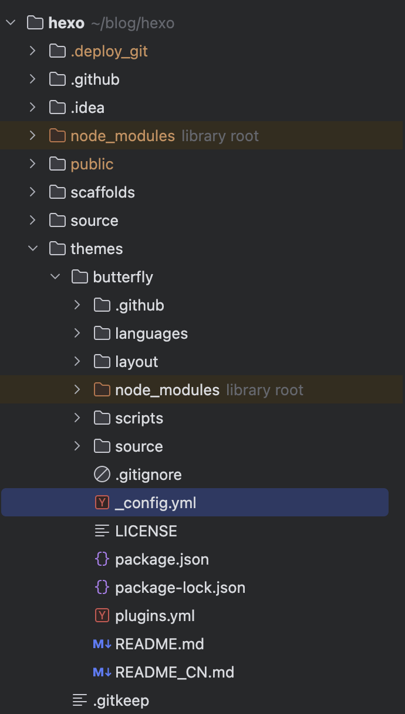

## 🌟 Butterfly 主题简介

Butterfly 🦋 是 Hexo 主题中极具美感与功能性的代表！无论是简约设计 🎨，还是个性化定制 🔧，都能满足不同博主的需求。本篇文章将带你深入解析 `_config.butterfly.yml` 配置文件的各项参数，助你打造一个独一无二的博客世界 🌍✨！

## 📁 目录结构

在主题目录中找到 `_config.yml` 文件，你将看到如下结构：



---

## 🚀 导航栏设置

```yaml
nav:
  logo:
  display_title: true
  fixed: false
```
🖼 **logo**：设置导航栏的 Logo 图片，个性化你的站点！
📌 **display_title**：是否显示站点标题，让访客一眼识别你的博客 🎯。
🔒 **fixed**：是否固定导航栏，`true` 让导航栏始终可见，增强用户体验 🏆。

---

## 📜 菜单管理

```yaml
menu:
  # 首页: / || fas fa-home
  # 归档: /archives/ || fas fa-archive
  # 分类: /categories/ || fas fa-folder-open
  # 标签: /tags/ || fas fa-tags
```
🌟 **菜单栏** 是访客探索博客的指南针 🧭，你可以自由添加导航项，并使用 FontAwesome 图标装饰 🎭。

---

## 💻 代码块设置

```yaml
code_blocks:
  theme: light
  macStyle: true
  height_limit: 400
  word_wrap: false
  copy: true
  language: true
  shrink: false
  fullpage: false
```
✨ **代码高亮主题**：选择 `darker` 🌑、`light` 🌞、`ocean` 🌊 等风格，让你的代码更加赏心悦目！
🖥 **macStyle**：是否启用 Mac 风格，带来更高级的代码显示体验 🍎。
📏 **height_limit**：设置代码块最大高度，超过部分滚动查看，避免页面过长 📜。
📋 **copy**：是否显示复制按钮，助力快捷复制 🚀。
🌍 **fullpage**：是否允许全屏查看代码，让代码展示更清晰 🏆。

---

## 📢 社交媒体链接

```yaml
social:
  fab fa-github: https://github.com/你的GitHub || GitHub || '#24292e'
```
🔗 **社交媒体链接**：轻松连接你的 GitHub、Twitter、WeChat 等，让访客随时找到你 📬！

---

## 🖼 站点图片设置

```yaml
favicon: /img/favicon.png
avatar:
  img: /img/Avatar.png
  effect: false
background: /img/background.png
```
🌟 **favicon**：设置网站图标，为浏览器 Tab 页增添个性化标识 🎭。
🎭 **avatar**：头像显示，可搭配动画特效，让页面更具活力 🚀。
🎨 **background**：背景图片/颜色，塑造你的专属博客氛围 🏡。

---

## 📖 文章相关设置

```yaml
toc:
  post: true
  page: false
  number: true
  expand: false
  style_simple: false
  scroll_percent: true
```
📚 **目录 TOC**：让文章结构一目了然 📖。
🔢 **number**：是否显示章节编号 📑。
📂 **expand**：目录默认是否展开 🔍。

---

## 🏡 首页文章布局

```yaml
index_layout: 3
index_post_content:
  method: 3
  length: 500
```
📰 **首页文章排布**：提供 `左右交错`、`瀑布流`、`封面式` 等多种布局方式 📌。
📝 **摘要字数**：可自定义摘要长度，避免首页过长 🏆。

---

## 💬 评论系统

```yaml
comments:
  use:
  text: true
  lazyload: false
  count: false
```
💭 **评论系统**：支持 `Disqus`、`Gitalk`、`Valine` 等，增强访客互动 🎤。

---

## 🎭 侧边栏设置

```yaml
aside:
  enable: true
  position: left
  card_author:
    enable: true
    description: "🎉欢迎访问我的博客！🎉"
```
📌 **侧边栏**：让访客更快找到所需内容 🚀。
📝 **作者信息**：展示你的个性签名，让访客认识你 👨‍💻。

---

## 🌙 夜间模式与阅读模式

```yaml
darkmode:
  enable: true
  button: true
readmode: true
```
🌗 **夜间模式**：一键切换暗色主题，护眼更舒适 🌚。
📖 **阅读模式**：让文章显示更加沉浸式，减少干扰 🌅。

---

## 📊 站点统计

```yaml
baidu_analytics:
google_analytics:
cloudflare_analytics:
```
📊 **访问数据分析**：支持百度统计、Google Analytics、Cloudflare Analytics，轻松掌握网站流量 🔍。

---

## 🎉 文章分享

```yaml
share:
  use: sharejs
  sharejs:
    sites: facebook,twitter,wechat,weibo,qq
```
📢 **社交分享**：一键分享到 Facebook、Twitter、WeChat、QQ 等平台 🔥。

---

## 🔍 搜索功能

```yaml
search:
  use: local_search
  placeholder: "搜索..."
```
🔎 **搜索**：支持本地搜索或 Algolia 搜索，让访客轻松找到内容 🕵️‍♂️。

---

## 🏆 高级功能

```yaml
pjax:
  enable: false
lazyload:
  enable: false
pwa:
  enable: false
```
⚡ **Pjax**：提升页面切换速度，优化用户体验 🚀。
🖼 **Lazyload**：图片懒加载，提高页面加载性能 ⏳。
🎖 **PWA**：渐进式网页应用，让博客拥有 App 体验 📱。

---

💡 通过本文的详细配置解析，相信你已经可以打造个性化的 Butterfly 主题博客了！快来动手试试吧 🎨✨！

