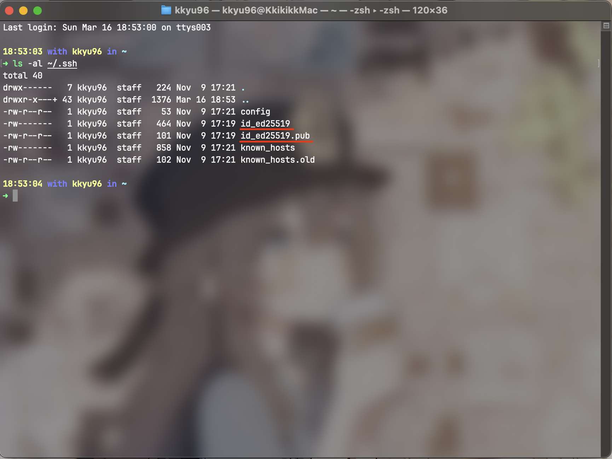
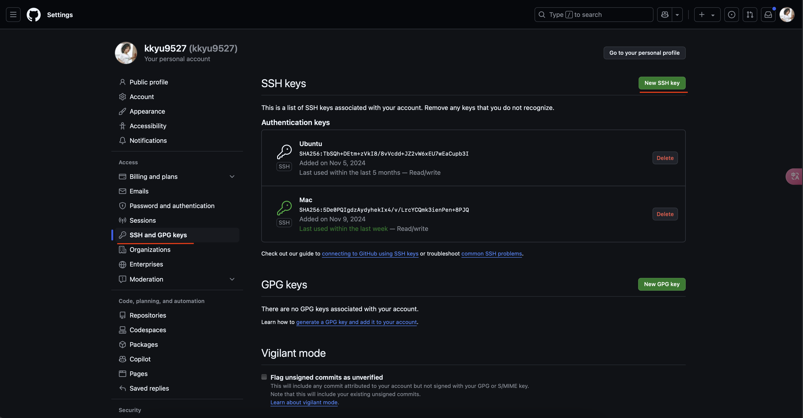
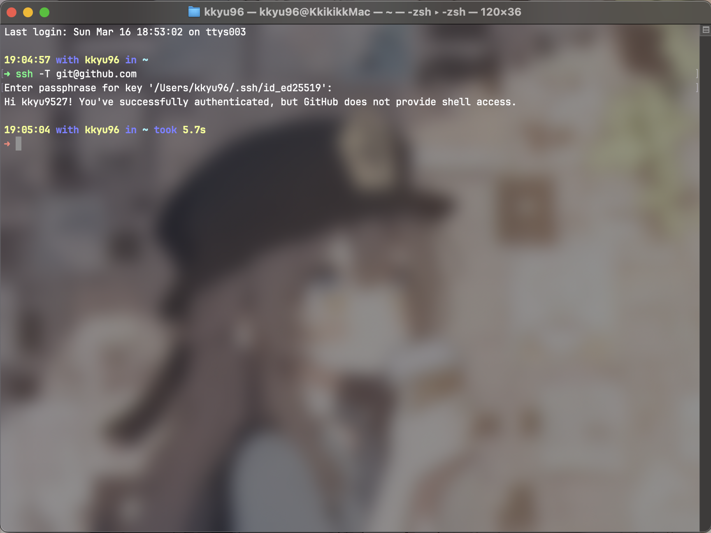

## 🌟 为什么要添加 SSH 密钥？

在 GitHub 中添加 **SSH 密钥** 可以提升 **Git 操作的安全性 🔒**，让你 **免去每次输入用户名和密码的烦恼**，提高开发效率 ⏩。

通过 SSH 认证，你可以安全地 **推送（push）、拉取（pull）** 代码，而无需每次都手动输入凭据。🎯

下面，我们将分步讲解如何在 GitHub 添加 SSH 密钥，让你的 Git 之旅更加顺畅！ 🚀

⸻

## 🔍 1. 检查是否已有 SSH 密钥 🔑

在终端（Linux/macOS）或 Git Bash（Windows）中运行以下命令，检查是否已有 SSH 密钥：
```bash
ls -al ~/.ssh
```


✅ 如果看到类似 `id_rsa` 和 `id_rsa.pub` 文件，表示已经存在 SSH 密钥，可以直接使用。
❌ 如果没有，则需要创建新的密钥。

⸻

## ✨ 2. 生成新的 SSH 密钥（如果没有的话） 🔐

如果你没有 SSH 密钥，可以运行以下命令生成一个：

```bash
ssh-keygen -t rsa -b 4096 -C "your_email@example.com"
```

📌 **参数解释**：
- `-t rsa`：指定使用 **RSA 算法** 🔢
- `-b 4096`：设置密钥长度为 **4096 位（推荐）** 🔥
- `-C "your_email@example.com"`：添加一个 **标识（通常是你的 GitHub 绑定邮箱）** 📧

💡 当系统提示：
```bash
Enter a file in which to save the key (/home/user/.ssh/id_rsa):
```
直接按 **Enter**，使用默认路径。

然后会要求输入 **密码短语（passphrase）**，可以留空，或者输入一个安全的密码短语（推荐增加安全性）。

⸻

## 🎯 3. 添加 SSH 密钥到 SSH 代理 🏹

首先，确保 SSH 代理正在运行：

```bash
eval "$(ssh-agent -s)"
```

然后，将新的 SSH 私钥添加到 SSH 代理：

```bash
ssh-add ~/.ssh/id_rsa
```

⸻

## 📋 4. 复制 SSH 公钥 ✂️

使用以下命令复制 SSH 公钥：

```bash
cat ~/.ssh/id_rsa.pub
```

或者：

```bash
clip < ~/.ssh/id_rsa.pub  # 适用于 Windows Git Bash
pbcopy < ~/.ssh/id_rsa.pub  # 适用于 macOS
```

然后，将 **复制的密钥粘贴到 GitHub 账户** 中。

⸻

## 🛠️ 5. 在 GitHub 添加 SSH 密钥 🔗
1️⃣ **登录 GitHub**，进入 **SSH and GPG keys** 页面。
2️⃣ 点击 **“New SSH key”** 按钮。

3️⃣ **Title（标题）**：输入一个 **描述性名称**（如 *“My Laptop SSH Key”*）。
4️⃣ **Key（密钥）**：粘贴刚刚复制的 **SSH 公钥内容**。
5️⃣ 点击 **“Add SSH key”** ✅ **保存**。

⸻

## 🔗 6. 测试 SSH 连接 🎯

运行以下命令测试 SSH 连接 GitHub：

```bash
ssh -T git@github.com
```

如果一切正常，会看到类似的输出：
```bash
Hi username! You've successfully authenticated, but GitHub does not provide shell access.
```



✅ 这表示 **SSH 连接 GitHub 已成功**！ 🎉

⸻

## ⚙️ 7. 配置 Git 使用 SSH（可选） 💡

如果你希望 **Git 默认使用 SSH 而不是 HTTPS**，可以运行：

```bash
git config --global url."git@github.com:".insteadOf "https://github.com/"
```

💡 这样，所有 `https://github.com/xxx` 的仓库地址都会自动转换为 `git@github.com:xxx`。

⸻

## 🚀 8. 使用 SSH 进行 Git 操作 ⚡

现在你可以使用 SSH 来 **克隆仓库** 📂：

```bash
git clone git@github.com:your-username/your-repository.git
```

或者进行其他 Git 操作，如 **推送代码**：

```bash
git push origin main
```

⸻

## 🎯 总结 📜
✅ **检查是否已有 SSH 密钥** (`ls -al ~/.ssh`)
✅ **生成 SSH 密钥** (`ssh-keygen -t rsa -b 4096 -C "your_email@example.com"`)
✅ **启动 SSH 代理并添加私钥** (`eval "$(ssh-agent -s)"; ssh-add ~/.ssh/id_rsa`)
✅ **复制公钥并添加到 GitHub**
✅ **测试 SSH 连接** (`ssh -T git@github.com`)
✅ **配置 Git 默认使用 SSH（可选）**
✅ **使用 SSH 进行 Git 操作**

📌 按照这个流程，你可以顺利在 **GitHub** 上 **配置 SSH 认证**，提高 **Git 操作的安全性和便利性**！ 🚀🎉

