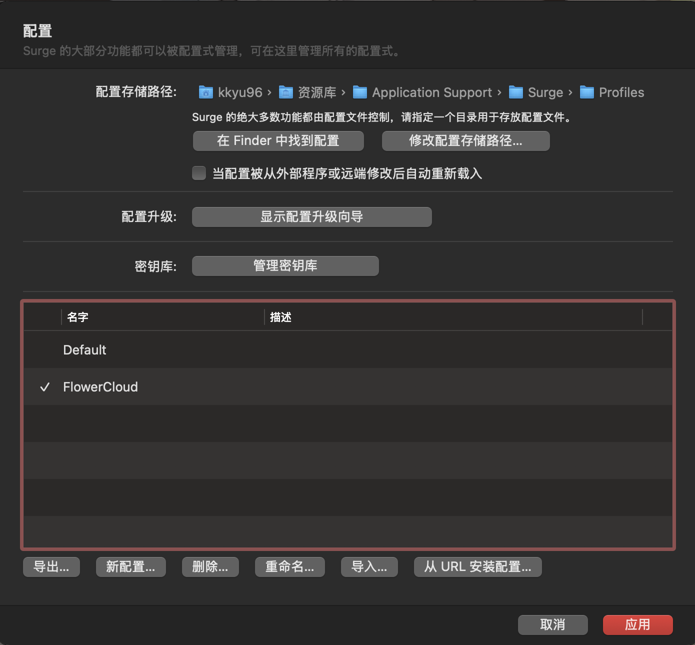

# 🚀 我的 Surge 配置记录

## 🌟 1️⃣ 新建配置

创建一个✨ **空白配置** ✨：



📌 在 Surge 应用中新建一个空配置文件，然后将以下配置代码粘贴进去。

```conf
[General]
# > 日志级别
loglevel = notify
show-error-page-for-reject = true
# > 允许Wi-Fi访问
allow-wifi-access = false
# > All Hybrid 网络并发
all-hybrid = false
# > IPv6 支持（默认关闭）
ipv6 = false
# > IPv6 VIF（默认禁用）
ipv6-vif = disabled
# > 测试超时（秒）
test-timeout = 2
# > Internet 测试 URL
internet-test-url = http://www.baidu.com
# > 代理测速 URL
proxy-test-url = http://connectivitycheck.gstatic.com/generate_204
# > GeoIP数据库
geoip-maxmind-url = https://github.com/Hackl0us/GeoIP2-CN/raw/release/Country.mmdb
# > 排除简单主机名
exclude-simple-hostnames = true
# > DNS 服务器
dns-server = 223.5.5.5, 119.29.29.29
# > DNS 加密服务器
encrypted-dns-server = https://223.5.5.5/dns-query
# > DNS 劫持
hijack-dns = 8.8.8.8:53, 8.8.4.4:53
# > 从 /etc/hosts 读取 DNS 记录
read-etc-hosts = true
# > 远程控制器
http-api-web-dashboard = true
use-default-policy-if-wifi-not-primary = false
# > 跳过代理
skip-proxy = 192.168.0.0/24, 10.0.0.0/8, 172.16.0.0/12, 127.0.0.1, localhost, *.local
# > Always Real IP
always-real-ip = *.srv.nintendo.net, *.stun.playstation.net, xbox.*.microsoft.com, *.xboxlive.com, *.battlenet.com.cn, *.battlenet.com, *.blzstatic.cn, *.battle.net
# > 兼容模式(若需要使用Homekit摄像头，可以开启兼容模式，但开启兼容模式会导致一些屏蔽广告的模块失效，请自行取舍)
# compatibility-mode = 5
# > Surge VIF
# tun-excluded-routes = 192.168.0.0/16, 10.0.0.0/8, 172.16.0.0/12
# tun-included-routes = 192.168.1.12/32
# > 禁用 GEOIP 自动更新
disable-geoip-db-auto-update = true
# > 当节点不支持UDP时，默认fallback 到reject
udp-policy-not-supported-behaviour = reject

[Proxy Group]
# > 策略组
🇭🇰 香港节点 = select, include-other-group=✈️ 全球代理, update-interval=0, no-alert=0, hidden=0, include-all-proxies=0, policy-regex-filter=(🇭🇰)|(香港)|(Hong)|(HK), icon-url=https://raw.githubusercontent.com/Semporia/Hand-Painted-icon/master/Rounded_Rectangle/Hong_Kong.png

🇺🇸 美国节点 = select, include-other-group=✈️ 全球代理, update-interval=0, no-alert=0, hidden=0, include-all-proxies=0, policy-regex-filter=(🇺🇸)|(美国)|(States)|(US), icon-url=https://raw.githubusercontent.com/Semporia/Hand-Painted-icon/master/Rounded_Rectangle/United_States.png

🇯🇵 日本节点 = select, include-other-group=✈️ 全球代理, update-interval=0, no-alert=0, hidden=0, include-all-proxies=0, policy-regex-filter=(🇯🇵)|(日本)|(Japan)|(JP), icon-url=https://raw.githubusercontent.com/Semporia/Hand-Painted-icon/master/Rounded_Rectangle/Japan.png

🇨🇳 台湾节点 = select, include-other-group=✈️ 全球代理, update-interval=0, no-alert=0, hidden=0, include-all-proxies=0, policy-regex-filter=(🇨🇳)|(台湾)|(Tai)|(TW), icon-url=https://raw.githubusercontent.com/Semporia/Hand-Painted-icon/master/Rounded_Rectangle/China.png

🇰🇷 韩国节点 = select, include-other-group=✈️ 全球代理, update-interval=0, no-alert=0, hidden=0, include-all-proxies=0, policy-regex-filter=(🇰🇷)|(韩国)|(Korea)|(KR), icon-url=https://raw.githubusercontent.com/Semporia/Hand-Painted-icon/master/Rounded_Rectangle/South_Korea.png

🇸🇬 新加坡节点 = select, include-other-group=✈️ 全球代理, update-interval=0, no-alert=0, hidden=0, include-all-proxies=0, policy-regex-filter=(🇸🇬)|(新加坡)|(Singapore)|(SG), icon-url=https://raw.githubusercontent.com/Semporia/Hand-Painted-icon/master/Rounded_Rectangle/Singapore.png

✈️ 全球代理 = select, policy-path=https://api.wcc.best/sub?target=surge&ver=4&url=https%3A%2F%2Fapi.xmancdn.net%2Fosubscribe.php%3Fsid%3D154914%26token%3DBZBrvGBHAwuY&insert=false&config=https%3A%2F%2Fraw.githubusercontent.com%2FACL4SSR%2FACL4SSR%2Fmaster%2FClash%2Fconfig%2FACL4SSR_Online_Full_NoAuto.ini&emoji=true&list=false&xudp=false&udp=false&tfo=false&expand=true&scv=true&fdn=false, update-interval=0, no-alert=0, hidden=0, include-all-proxies=0, icon-url=https://raw.githubusercontent.com/Semporia/Hand-Painted-icon/master/Universal/Final.png
OpenAi = select, include-all-proxies=0, include-other-group=✈️ 全球代理, hidden=0, policy-regex-filter=(高级)

[Rule]
# > 广告拦截
# RULE-SET,https://raw.githubusercontent.com/thNylHx/Tools/main/Ruleset/Surge/Block/Ads_ml.list,REJECT,pre-matching,extended-matching
# > OpenAI
RULE-SET,https://raw.githubusercontent.com/EAlyce/conf/refs/heads/main/Rule/OpenAI.list,OpenAi // OpenAi
# > 苹果
RULE-SET,https://raw.githubusercontent.com/blackmatrix7/ios_rule_script/master/rule/Surge/Apple/Apple_All_No_Resolve.list,DIRECT // Apple
# > GitHub
RULE-SET,https://raw.githubusercontent.com/blackmatrix7/ios_rule_script/master/rule/Surge/GitHub/GitHub.list,"🇭🇰 香港节点",no-resolve // github
# > 微软
RULE-SET,https://raw.githubusercontent.com/blackmatrix7/ios_rule_script/master/rule/Surge/Microsoft/Microsoft.list,DIRECT // Microsoft
# > Telegram
RULE-SET,https://raw.githubusercontent.com/blackmatrix7/ios_rule_script/master/rule/Surge/Telegram/Telegram.list,"🇺🇸 美国节点" // Telegram
# > Epic
RULE-SET,https://raw.githubusercontent.com/blackmatrix7/ios_rule_script/master/rule/Surge/Epic/Epic.list,"🇭🇰 香港节点" // Epic
# > Steam
RULE-SET,https://raw.githubusercontent.com/blackmatrix7/ios_rule_script/master/rule/Surge/Steam/Steam.list,"🇭🇰 香港节点" // Steam
# > YouTube
RULE-SET,https://raw.githubusercontent.com/blackmatrix7/ios_rule_script/master/rule/Surge/YouTube/YouTube.list,"🇸🇬 新加坡节点" // Youtube
# > Netflix
RULE-SET,https://raw.githubusercontent.com/blackmatrix7/ios_rule_script/master/rule/Surge/Netflix/Netflix.list,"🇸🇬 新加坡节点" // Netflix
# > Disney
RULE-SET,https://raw.githubusercontent.com/blackmatrix7/ios_rule_script/master/rule/Surge/Disney/Disney.list,"🇸🇬 新加坡节点" // Disney
# > Spotify
RULE-SET,https://raw.githubusercontent.com/blackmatrix7/ios_rule_script/master/rule/Surge/Spotify/Spotify.list,"🇸🇬 新加坡节点" // Spotify
# > TikTok
RULE-SET,https://raw.githubusercontent.com/blackmatrix7/ios_rule_script/master/rule/Surge/TikTok/TikTok.list,"🇯🇵 日本节点" // TikTok
# > BiliBili
RULE-SET,https://raw.githubusercontent.com/blackmatrix7/ios_rule_script/master/rule/Surge/BiliBili/BiliBili.list,DIRECT // Bilibili
# > 国内媒体
RULE-SET,https://raw.githubusercontent.com/blackmatrix7/ios_rule_script/master/rule/Surge/ChinaMedia/ChinaMedia.list,DIRECT // 国内媒体
# > 全球代理
RULE-SET,https://raw.githubusercontent.com/blackmatrix7/ios_rule_script/master/rule/Surge/Proxy/Proxy_All_No_Resolve.list,"✈️ 全球代理",extended-matching // 国外主流
# > 国内直连
RULE-SET,https://raw.githubusercontent.com/blackmatrix7/ios_rule_script/master/rule/Surge/ChinaMax/ChinaMax_All.list,DIRECT,extended-matching // 国内直连
# > 局域网地址
RULE-SET,LAN,DIRECT
# > DNS 查询失败走Final规则
FINAL,✈️ 全球代理,dns-failed // 兜底策略

[MITM]
skip-server-cert-verify = true
h2 = true
ca-passphrase = DB5943D8
ca-p12 = MIIKPAIBAzCCCgYGCSqGSIb3DQEHAaCCCfcEggnzMIIJ7zCCBF8GCSqGSIb3DQEHBqCCBFAwggRMAgEAMIIERQYJKoZIhvcNAQcBMBwGCiqGSIb3DQEMAQYwDgQIJnvsh+eNKpQCAggAgIIEGFCcHY4XopEufAptYY/UTwMFezaa2zIyM+4FR4rbei1w03yGyEf6UhlikQt8PKmDztWY0mzn/G3YMxydILCdd23OHlpWSNIUR9GsE7vE/pAld0ORJIxr+qCQmY6Hg3dCsBDk+z2LC6U3xTPGDG1lztGTcfQptNLY42rszwSFLDWhvf5kgF10FdmyZI20iyn2Odr+kOb9SVP1HfsoYQmfjFj3TMNj1OSYz+JrCS6qY/ftoxd2KmL+bqffW9TyoZFTFAjG7Ngj9XmfYuqerbEv4Y+R5H52N6u6JEQUgL3Y3KQLG5S06eewXrXyVrOVb29XmcRDbUPVMfd5A788YdcvDtL7LXPSQHgzb3THkDVD5uSxaqEq9uNhzOPLBAvdvsoKDBDqzFuGznBuXfYo9zpyzIOozK6Wu84Mi1A5UAKn7/+qLinDXSt1TfJ9+bLJVoP9gfrznoKFysoPSJRWd+mPe89eDObRha8XvIznfseefmj+hKMlUJGsiwNdpxDvdO5vSi/slYpfRCfjGQWbafuDlA68CanzGcXqHz7OTi6cXv9k6rV8AC6WGAihAvxyEfxwFOzVwIFYwdSgLsAWw1bvvlsMm7Ug9+b90HwZ57X/Zdg2y5NJ5X9IwvU8zTh/mKOYAGOlWy1G/MlIKAPWyOV/SPWBeXDOpIcu9EU7Cpo5GG3IXBWS4Y+W/9AI3wX1/SjTIw7DnQu8Kwomf1qqsEqy45lk1c03p97glu476y7Lct9ZVAce3uNq7YJk15dt+ytPIYXjjkknWtwyBqki/wGLTgeA8ch8u5dW2aZeSacKu4IO7y61JzrrXrvu8RFl5HY9oXEIckn3AzN1mMsRCGLzZTiEeoyHzkJAOIt15wVHusKtPRTrao9IJ7LVVQO4lazrkvDf0Zg4O8T8P3aHtXwQCW47q1U0mbUKR+vbX2mYiu0mkSrLNaVOogOJPxfCbk1toK2x1gFyBO25Re4yc5CxeC6VdiAlP7wPe/UvlQxiOmm03PBpS9mPCtxlawpCImf5hCUlE86npGuwSeSRQy4ZcDu2EgECGt1ygigfNja/9rdWZW9U598Uvc30jltmZXd8QKzWzvxJZ8qPGqz23agRbdSYzSAmdFjhgJ5+J1c2/gMJlkiF1Trldohkya+mTjU6jyrV9O/tFlE9mbuT/iP+MH45laOuQE0/pj/Nzm26LRciLhYMSFHxaD/nN02lOK/7DvMBRxBFQ04Wh7s9uSIngWYlUi4LCu0fUbsRL5XP1Br5JGAXUs9UEBtrQW0g+S7HiCUol/lVO2GNSlpsfqBr20wykAJZyjGKuslILviN6pOrdP/CGbgsxDsKl5LRIcOPa3asON4vCIatraWOdUF/2kT5SRntIfS5qxtbPgP9jS72ZNZkokz4YCUwggWIBgkqhkiG9w0BBwGgggV5BIIFdTCCBXEwggVtBgsqhkiG9w0BDAoBAqCCBO4wggTqMBwGCiqGSIb3DQEMAQMwDgQI/fBMW8nh5TsCAggABIIEyAP/QmzYmpgpYfuomiWhoFKWIrsPZF3nd6dr61jU/sFZt7S2+y0ekdFw1/I2QLyfFTVgTrUs7/H3CQq2zPg/gwZUoXDRLkDaZUo+DOP4bz/d3/oRbl+XPoKFx3RuCBNXKKSJre68+GCFn/WrbY5SMuWirOQSSJnDd0T6cMnq+M+KvvJkK2+LfCTDvYZP16qTaUjciofh3bCWkQuhmxbX9hkRllSaNtQhOAdJyyyV5u1WmrHDNrb9i29XPyrOpt8VQ8cv6JF9s1puLYwA4be+UBdjNQWRVgLt06i7rtrGD2xdTo220ByEo88zqVw3TMtg7uy0yuPGPzjRj6XXkdjWt91WAmP1x558CvREFcDzVcLe54a6aLdz6iRBF6C5y3ljwDfXSplzcDfVlLLZZaqGQVjIK7u3cLySoNJU/ki7LnWVwVWYstQBdC7NHnI/Y63iaLwk1E/1ZDq0BnHqpTw5sjxyKjtlLoNKcxlWZlMRD23z5TXJD+9wd6GaymBo5buzahae/oKqUwFrWweKo7CzV2dhUS4W01Yoiwpijf5lStEN+46Dm7Knmz6e4YHFNz/uSf6jLudXTJ61LznQrPSzJWbui4OnASW/Bt+J5MFzYNIPTbeubdi8WJ+SOtUFHxUJmkwX3ylWI6+f3VhOLrcE2K9TVhqnJo1NDb8vQRw7OaHh0RpKUOn/HPp+mpnoFuVprkKzo1UG1Pt0C9jTPSOXpk2+3giWpdPy/6PYdUBWz+2Tm7VCnPlmcMHDWDxMsL8ohk/vsMHu+wTYOvpPIx2Lxskr6s6/MPpWRUBW1JVSgQ4EPNrzOuhY9UxNInMhwIr2+Z5NZHoyKTrcTV30BJPpThD07tRiM1S4b3wGmDuK0CFS2PocPvO7USbs5KnJ1fkSg3GMv7Yye8TFwMnFBYGvDujE+K2MhhNMKyPJVopMamb5/Zj1mQK/KlOSX1KcUr8gyBxbwxoCwzCAJws1dokLeUFNH9uMdHg/PIHoMeAJ/pF+W+B/NDbMXncApMp+kvZ5T2I+gtYN7bMAi2UZu8mDJwgP55+iyRnxtCLclNvwKtlndlG6YfPLt5fpmscPDqdcog95IpYACPxea96OYxiWFntJqvDyeAzuWhdIH66xuMJm3OyuWiXd44xjfGpnbBE383OaYL0wGqQlaCenBb47DnkifBGWZcRB2UGtib5r5Wxbo2wnLu+EGrdaIkSKsqF6CgfW+/VEIcRcIBVnJGK5XhP6PsVO+pAAih36RpohzEu43LyAhMDaO2guZq5ykct/vilJgaIsf82pj81VfQrbN1aX/rTuawrMEYWTXAi4UDr8gMStBB2S8tn1cdwpZAm1Tx55FXSHxrGLW19xIqbkS40OqAvGLqLO4dUDLzrkE31M741ExYGTp0LsBzmnSemOsvY/CLnGmCpF8K1Q0KQMXN5coV4WQOtjvbTl1XbTQ0fPuJFcrRLP4xMS+AgbILhSnD8NWzlvvrAXiH2HjdrmMw4jsmWni1A2P01QHlMhpQDzXEIt28klaaHs7wYNGtjdBsHZh49euGAJYC97NFTN4VTDVXKEaSF1/DKd7untdIPORZ3iuqEkKCK9KMYDjs9ixv4cC0LxeTGAqlE6kUirIa3z/IXvlHXF+DFsMCMGCSqGSIb3DQEJFTEWBBQVgU+zm6bemvWVTUvnnCSkp8Cm3TBFBgkqhkiG9w0BCRQxOB42AFMAdQByAGcAZQAgAEcAZQBuAGUAcgBhAHQAZQBkACAAQwBBACAARABCADUAOQA0ADMARAA4MC0wITAJBgUrDgMCGgUABBTfeNChzcXhh9I09ZOe1UB0eQre8QQIYNXw2I1pCDA=
```

## 🛠️ 2️⃣ 修改配置

### 🆕 2.1️⃣ 新增规则

访问 [📂 GitHub仓库](https://github.com/blackmatrix7/ios_rule_script/tree/master) 📚，选择所需的规则集，并按以下步骤添加：

- 在 `[Rule]` 标签下插入规则集链接
- 在规则末尾选择对应的策略组
- 补充清晰的注释 📝✨

🔖 **示例：**

```conf
RULE-SET,你的规则链接地址,对应策略组名 // 你的注释说明
```

### 🎯 2️⃣ 修改配置

#### 🎨 修改 `[Proxy Group]` 配置

🛠 在配置文件中自定义你的策略组，快速方法包括：

- 复制已有的策略组配置，稍作调整
- 或使用 Surge 的可视化编辑功能 📲✨

---

## 📖 Surge 配置概览（示例）

🌐 **全局代理节点选择**

- 🇭🇰 香港节点
- 🇺🇸 美国节点
- 🇯🇵 日本节点
- 🇨🇳 台湾节点
- 🇰🇷 韩国节点
- 🇸🇬 新加坡节点

🚀 **精选服务专用节点**

- 🎯 OpenAI 专用
- 🎮 Steam 专用
- 📺 YouTube 专用
- 🎧 Spotify 专用
- 🎥 Netflix 专用
- 🎵 TikTok 专用

🚫 **广告拦截** (可选，默认已注释掉)

🧩 **常用规则来源**：

- 苹果 🍎：直连 (Direct)
- GitHub 🐙 (香港节点)
- Telegram ✈️ 🇺🇸
- 微软服务 ☁️ DIRECT

🏠 **局域网和国内直连**

📡 **DNS 优化与防劫持配置**

---

## 🚀 **配置建议与优化提示**

- 使用不同国家的节点可以优化访问特定区域服务的体验 🌏✨
- 定期检查规则更新并优化节点选择 🌟
- 根据自己需求，开启广告屏蔽等附加功能来提升整体体验 🚫🚀

---

🎉 **大功告成！现在尽情享受🚀Surge吧～** 🎉

